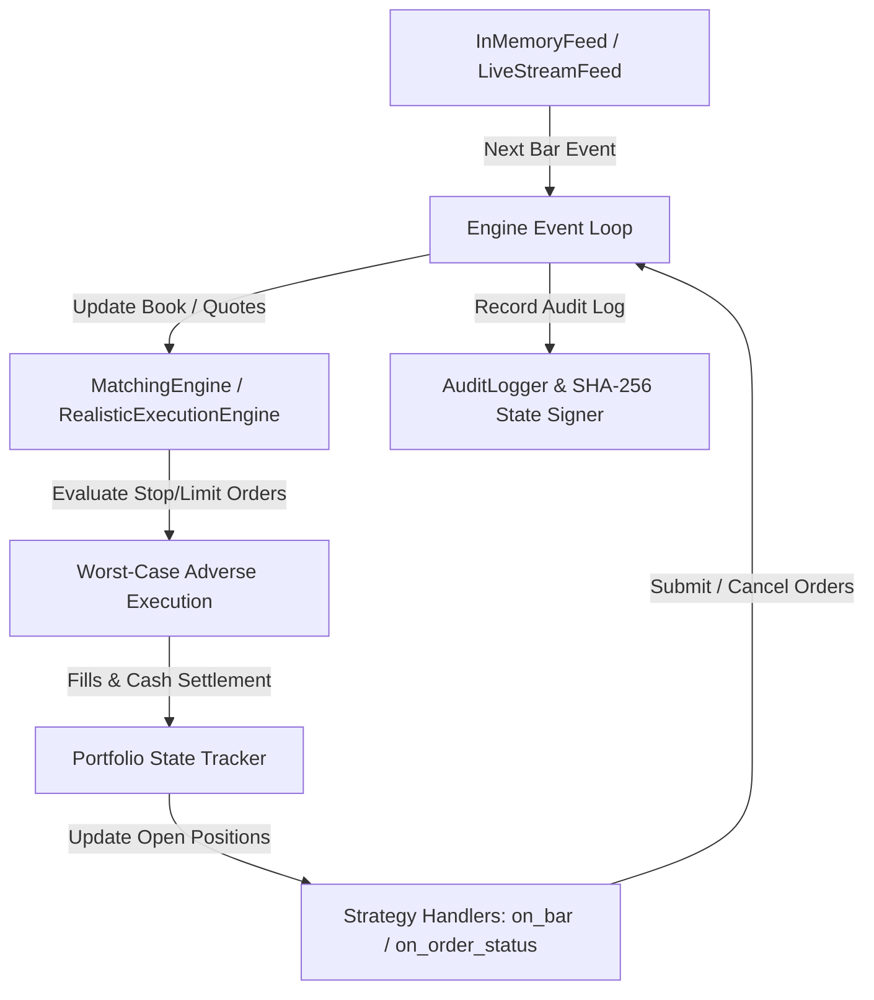

# SSBT Engine Architecture

---
summary: Detailed architectural breakdown of engine lifecycle, data flow, order matching logic, causality, determinism, and zero-allocation Numba/Polars performance model.
keywords: architecture, engine lifecycle, matching engine, causality, point in time, polars, numba, zero allocation
domain: architecture
difficulty: advanced
primary_apis: ssbt.Engine, ssbt.MatchingEngine, ssbt.Portfolio, ssbt.InMemoryFeed
related_pages: /docs/index.md, /docs/architecture/current-backtest-flow.md, /docs/reference/index.md
---

## Overview

SSBT is architected around a strict single-pass, point-in-time event dispatch loop designed for high throughput (>1,000,000 bars/second) and absolute zero lookahead bias.

---

## Core Architectural Modules

### 1. Engine Lifecycle & Event Flow
1. **`on_start(engine)`**: Strategy initialization lifecycle callback.
2. **Bar Event Iteration**: `Engine` pulls point-in-time bar ticks sequentially sorted by ascending timestamp.
3. **Pending Order Matching**: Pending stop/limit/trailing-stop orders are evaluated against bar `[open, high, low, close]` prior to executing strategy code.
4. **`on_bar(engine, bar)`**: Strategy handles current bar and submits new orders.
5. **Portfolio Accounting**: Fills update cash balance, realized PnL, margin requirements, and unrealized equity.
6. **`on_stop(engine)`**: Finalization callback releasing resources and computing `BacktestResult`.

### 2. Worst-Case Adverse Execution Pipeline
Pending orders match using conservative order sequencing to ensure backtests never overestimate execution performance:
- Fills match against current open position direction first.
- Stop-loss orders are evaluated **before** profit target fills on the same bar.
- Limit orders fill at limit price or bar open if gap occurs.

### 3. Orderbook Reconstruction & Partial Fills
- `rebuild_orderbook_from_bars` synthesizes L2 bid/ask depth quote stacks from OHLCV bars.
- `OrderBookEngine` enforces `OrderStatus.PARTIALLY_FILLED` when requested order quantity exceeds cumulative book depth at the order price level.

### 4. Point-In-Time Causality & Anti-Lookahead Boundaries
- Multi-frequency data feeds are joined via `align_multi_timeframe()` using backward `asof` matching.
- `AuditLogger` verifies timestamp monotonicity ($ t_i \ge t_{i-1} $) and calculates SHA-256 digests over simulation state.

### 5. Performance Model: Polars Arrow Memory & Numba Loops
- Core bar iteration loops are powered by zero-copy Polars Arrow column arrays and pre-compiled Numba C-FFI kernels.
- Memory allocation inside the bar loop is zeroed out by pre-allocating equity curve and trade logs.
